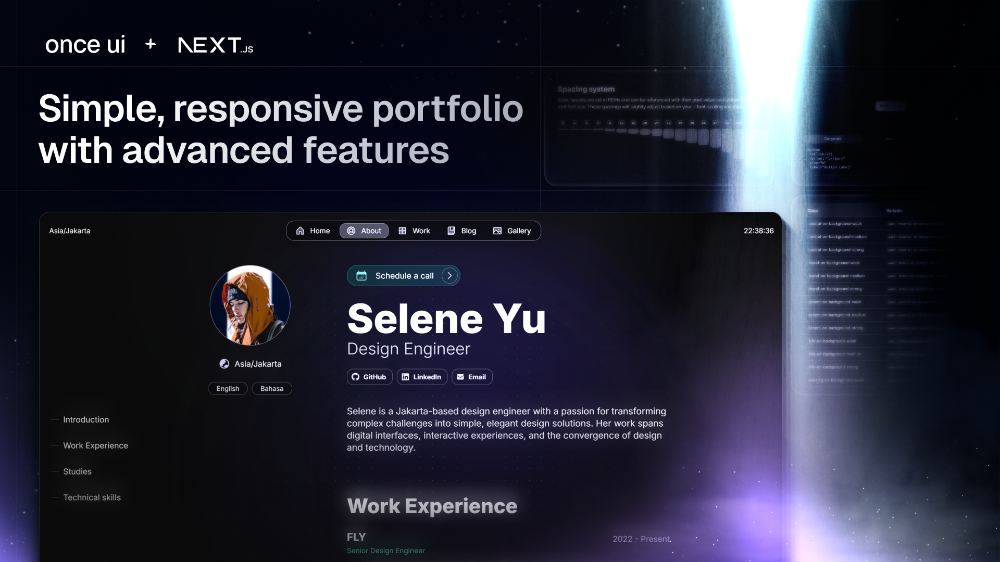

# **Guanggeng Yang's Portfolio**

This is my personal portfolio website built with Next.js, Tailwind CSS, and Once UI components. View the [live site here](https://guanggeng-website.web.app).



## **Tech Stack**

- **Framework**: Next.js 14
- **Styling**: Tailwind CSS + Once UI Components
- **Deployment**: Vercel
- **Content**: MDX for blog posts and project descriptions

## **Main Features**

- 🎨 Modern and responsive design
- 📱 Mobile-first approach
- 🌙 Dark/Light mode support
- ⚡️ Fast page loads with Next.js
- 📝 Blog support with MDX
- 🔍 SEO optimized
- 📊 Google Analytics integration

## **Project Structure**

```
├── src/
│   ├── app/           # Next.js app directory
│   ├── components/    # React components
│   ├── styles/        # Global styles
│   └── utils/         # Utility functions
├── public/            # Static files
└── content/          # MDX content
```

## **Local Development**

1. Clone the repository
```bash
git clone https://github.com/younggeng/ggy-portfolio-nextjs.git
```

2. Install dependencies
```bash
npm install
```

3. Start the development server
```bash
npm run dev
```

4. Open [http://localhost:3000](http://localhost:3000)

## **Content Management**

- Blog posts: Add `.mdx` files to `src/app/blog/posts`
- Projects: Add `.mdx` files to `src/app/work/projects`
- Main content: Edit `src/app/resources/content.js`
- Site config: Edit `src/app/resources/config.js`

## **Deployment**

The site is automatically deployed to Vercel with each push to the main branch.

[](https://vercel.com/new/clone?repository-url=https%3A%2F%2Fgithub.com%2Fyounggeng%2Fggy-portfolio-nextjs)

## **Contact**

- Email: [yangguanggeng960123@gmail.com](mailto:yangguanggeng960123@gmail.com)
- LinkedIn: [guanggeng-yang](https://www.linkedin.com/in/guanggeng-yang)
- GitHub: [younggeng](https://github.com/younggeng)
- Instagram: [young_gggy](https://www.instagram.com/young_gggy)

## **License**

This project is based on Once UI's Magic Portfolio template, which is distributed under the CC BY-NC 4.0 License.
- Commercial usage is not allowed
- Attribution is required

See `LICENSE.txt` for more information.